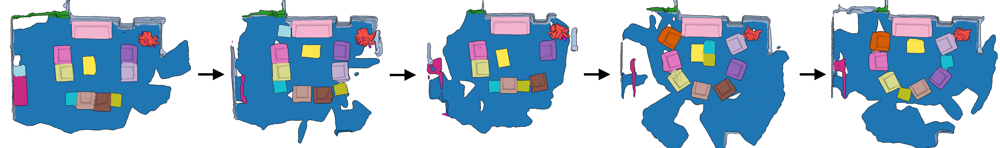

# Rescan

## Abstract
 _In depth-sensing applications ranging from home robotics to AR/VR, it will be common to acquire 3D scans of interior spaces repeatedly at sparse time intervals (e.g., as part of regular daily use).  We propose an algorithm that analyzes these ``rescans'' to infer a temporal model of a scene with semantic instance information.   Our algorithm operates inductively by using the temporal model resulting from past observations to infer an instance segmentation of a new scan, which is then used to update the temporal model. The model contains object instance associations across time and thus can be used to track individual objects, even though there are only sparse observations.  During experiments with a new benchmark for the new task, our algorithm outperforms alternate approaches based on state-of-the-art networks for semantic instance segmentation._

## Building

This repository contains code for "Rescan: Inductive Instance Segmentation for Indoor RGBD Scans", ICCV 2019. Code to perfrom inference is written in C++. You will need a compiler with C++11 support and CMake < 2.8.

To generate build files for Unix-like systems navigate to source code root directory and run:
~~~
cd apps
mkdir build
cd build
cmake ..
make
~~~
If you're planning to run this code on a lot of data and not do any changes, remember to generate release mode files:
~~~
cmake .. -DCMAKE_BUILD_TYPE=Release
~~~

The code for compling most of the application is contained within this repository. The exception is rsdb_viewer, an opengl program to view the files produced by Rescan Pipeline. To build it you need [glfw3](https://www.glfw.org/) library.

Additionally, to run the entire pipeline you will need PoissonSurfaceReconstruction from Kazdhan et al. Once you have the binaries, copy them to the bin folder created during the build time.

The evaluation scripts are written in Python 3.

## Running
To run the code you will need to download the [Rescan dataset](#). After downloading and compiling the code navigate to the root directory of the dataset (folder containing the *scene_list.txt* file). Then run:

~~~
python <path to scripts/run_segmentation_pipeline> scene_list.txt <path_to_rescan_bin_folder> <path_to_rescan_script_folder>
~~~

The <rescan_bin_folder> should contain following executables:
 - seg2rsdb
 - pose_proposal
 - segment_transfer
 - create_eval_files
 - PoissonRecon
 - SurfaceTrimmer

To evaluate the reconstruction quality you first need to convert the segmented .ply files that rescan pipeline outputs to scannet format,
by running:

~~~
create_eval_files <path_to_segmented_ply_file> <path_to_evaluation_folder>
~~~

Note that for evaulation you need perform the conversion of both ground truth and prediction segmentations.

After you have all the files you wish to evaluate on, the evaluate_<task_name>.py scripts can be used to produce the quantitative evaluation.

## Citation
If you use this code in your work, please cite this paper:

~~~
@article{HalberRescan19,
  title     = {Rescan: Inductive Instance Segmentation for Indoor RGBD Scans},
  author    = {Maciej Halber and Yifei Shi and Kevin Kai Xu and Thomas Funkhouser},
  booktitle = {ICCV},
  year      = {2019}
}
~~~
